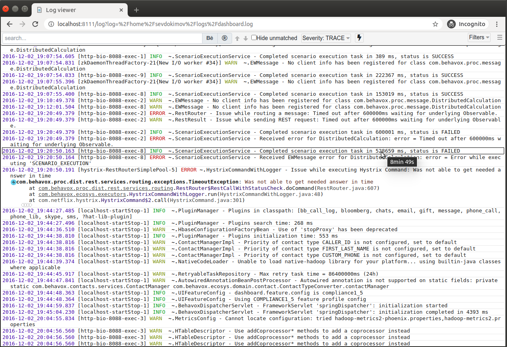

# LogViewer

LogViewer is a Web application for monitoring server logs in real-time in the browser.

The tool provides powerful UI with highlighting, filtering, search, folding inconsiderable text. Merging several logs into one view works as well.
 
LogViewer can show huge log files without significant resource consumption because it reads only the part of the file that a user is watching.
No indexing.

##### Screenshot

### Features

1. Highlighting fields, lines, parent brackets. Highlighting makes the log much more readable.
1. Event filtering by a level, logger, date, thread, etc... Filtering by a custom condition written on Groovy is available as well.
   [more details](_docs/filters.md)
1. Merging events from several log files and showing its as one log. If log files are located on different
machines, all machines must have run LogViewer.
1. Folding secondary information like unmeaning parts of exception stacktraces, full name of logger.
1. Detecting the format of the log file.
1. A permanent link to a log position. A user can copy a link to the current position and send it to another user.

[Demo video](https://www.youtube.com/watch?v=zY8b9ACenQo)

### Quick start

- Download LogViewer from [Github releases](https://github.com/sevdokimov/log-viewer/releases) and unpack it to any folder.
  Make sure the machine has installed Java 8 or later.
- Run `log-viewer-0.1.4/logviewer.sh`
- Open `http://localhost:8111`. There will be a file chooser to select a log from the file system.

User can open a log file using the file chooser on `http://localhost:8111` or by a direct link: _http://localhost:8111/log?***log=$pathToLogFile***_. For opening several log files in one view, 
pass several "log" query parameters, for example: _http://localhost:8111/log?log=***$pathToLogFile1***&log=***$pathToLogFile2***&log=***$pathToLogFile3***_ 
Note: all log files must have full timestamp, otherwise LogViewer cannot merge them.

Also, LogViewer can be embedded into another java web application, if you don't want to run it as a standalone process.
See [embedding to Spring Boot application](_docs/embadded-spring-boot.md) or [embedding to java web application](_docs/embadded.md)

### Configuration

Configuration is located in `log-viewer-0.1.4/config.conf`, the file has [HOCON](https://github.com/lightbend/config)
format. 

The most important configuration is a list of available files. Also, you can specify the log format if the automatic format 
detection works incorrectly; shortcuts for files/file sets, etc...

[More details about configuration](_docs/configuration.md)

### Performance
The idea to filter logs without indexing sounds questionable. If the filter settings filter out all elements,
the system has to scan the entire file to make sure that no visible events exist. Also, each search can perform a full scan of the log.
Actually, the full scan is not a big problem, the parser works fast enough. Parsing 1Gb file takes 3,5 sec on my machine. It is viable. 
Setting a date range filter can speed up the tool a lot because only events from the specified date range will be considered.